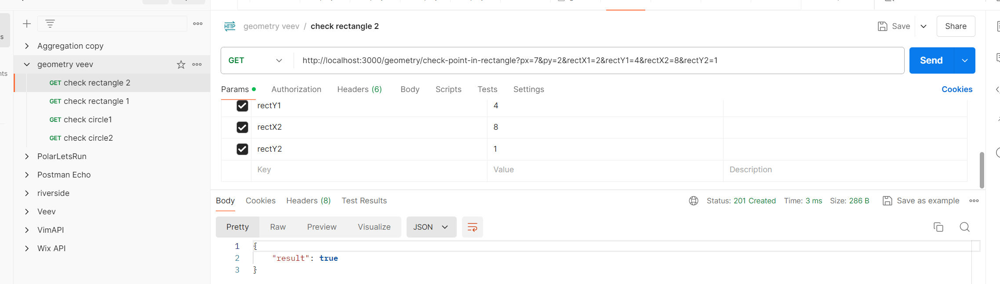
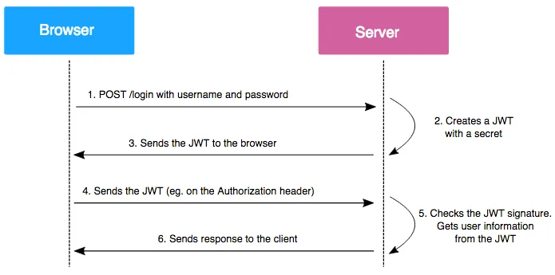

# Veev task
The ``` Veev task ``` is a back-end for new app of Geometrics checks 


# Rest API with MySQL 

| Methods	| Urls	                | Actions
| --------- | ----------------------| ------------------------|
| GET       | /geometrics/check-point-in-rectangle            | Checks id point inside of rectangle or not, for example: http://localhost:3000/geometrics/check-point-in-rectangle?px=5&py=3&rectX1=2&rectY1=4&rectX2=8&rectY2=1
| GET       | /geomentics/check-point-in-circle               | Checks id point inside of circle or not, for example: http://localhost:3000/aviation/check-point-in-circle?px=8&py=6&cx=6&cy=6&cr=4


## Project Structure
```bash

`-- tsconfig.json
```


## Local Installation
#### Runnning locally as standalone app. 

\* *Environment variables are not required*, application can run with predefined defaults
```sh
$ cd api
$ npm install
$ npm run start
```

 #### Runnning locally as production simulation 

- TODO: Use docker from the application folder, run ```docker-compose build``` and ```docker-compose up```

## Testing application 

Please use attached [Postman](https://www.getpostman.com/) JSON [collection](./geometry.postman_collection.json) in order to test API requests
You can import this collaction with prepared requests for tests



## Useful docs



[Jsonwebtoken documentation](https://www.npmjs.com/package/jsonwebtoken/)

[JWT Authentication in Node.js](https://dvmhn07.medium.com/jwt-authentication-in-node-js-a-practical-guide-c8ab1b432a49)


